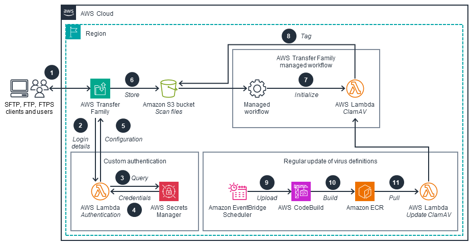
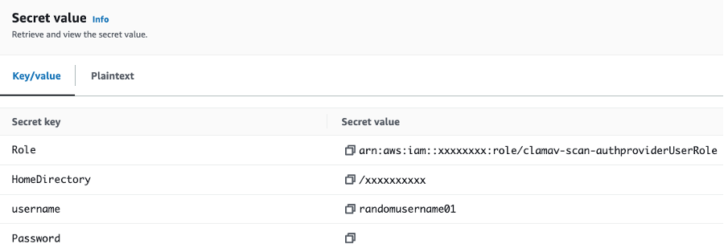
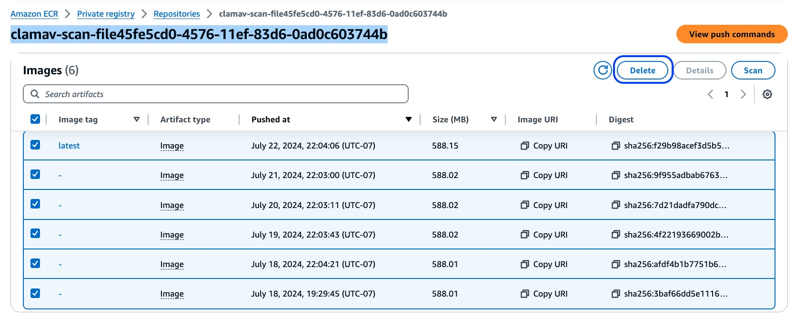
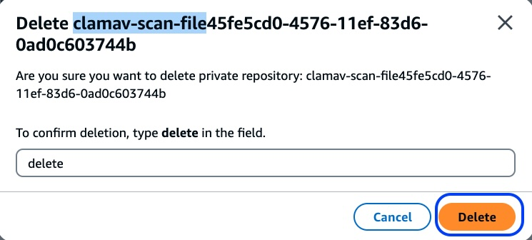
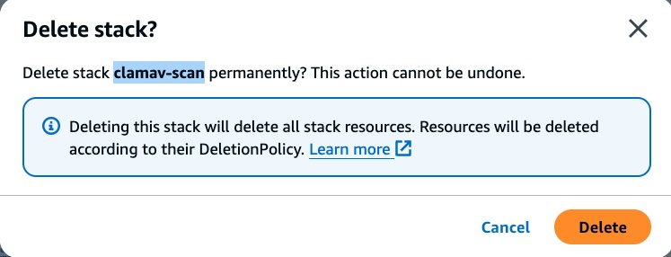
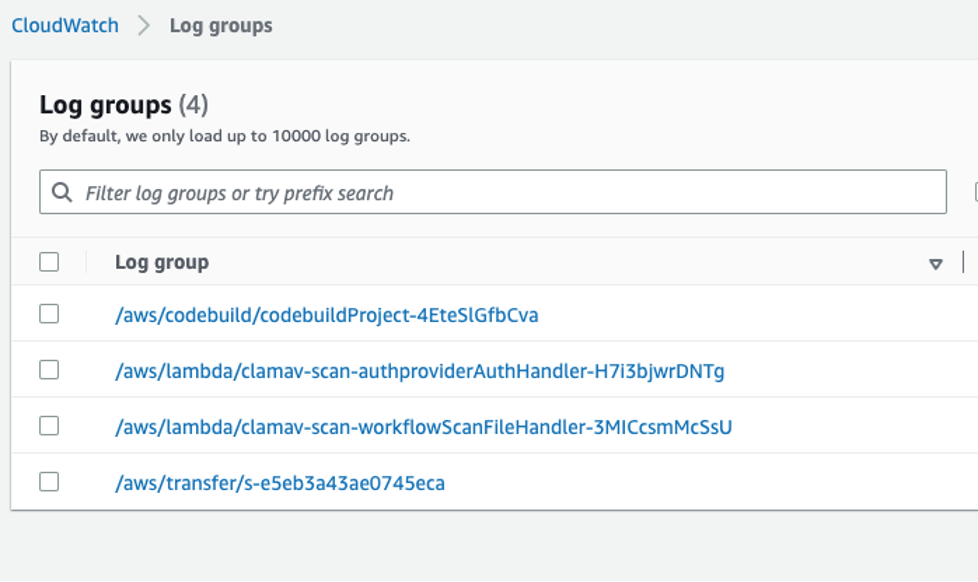

# Guidance for detecting malware threats using AWS Transfer Family

## Table of Contents
1. [Introduction](#introduction)
2. [Malware threats in file transfers](#malware-threats-in-file-transfers)
3. [Core Concepts](#core-concepts)
4. [Solution Overview](#solution-overview)
5. [Costs and licenses](#costs-and-licenses)
6. [Deployment options](#deployment-options)
7. [Deployment steps](#deployment-steps)
8. [Post deployment steps](#post-deployment-steps)
9. [Undeployment steps](#undeployment-steps) 
10. [Troubleshooting](#troubleshooting)
11. [Resources](#resources)
12. [Customer responsibility](#customer-responsibility)
13. [Feedback](#feedback)
14. [Notices](#notices)

---

<a name="introduction"></a>
## Introduction

This user guide is created for anyone who is interested in detecting malware threats using [AWS Transfer Family](https://aws.amazon.com/aws-transfer-family/) as it is a popular choice for secure file transfer tailor-made for [Amazon Simple Storage Service (Amazon S3)](https://aws.amazon.com/s3/) and [Amazon Elastic File System (Amazon EFS)](https://aws.amazon.com/efs/).

[Transfer Family managed workflows](https://docs.aws.amazon.com/transfer/latest/userguide/transfer-workflows.html) empower you to process files through preset actions, including copying, tagging, decrypting, and even custom preprocessing via AWS Lambda. This offers flexibility, allowing you to integrate your specific code for tasks like malicious content detection, PII obfuscation, data encryption, and alert generation. Upon file upload completion, Transfer Family's managed workflows initiate automatically, forwarding logs to Amazon CloudWatch.

This guide provides the steps to set up a workflow that leverages [Clam Antivirus (ClamAV)](https://www.clamav.net/) — a renowned open-source antivirus engine proficient in detecting a myriad of threats such as trojans, malware, and viruses with periodic updates to virus definitions to remain abreast of emerging threats.

Following this guide, you should be able to:
- Familiarize ypurself with managed workflow on AWS Transfer Family to detect the malware.
- Learn ways to detect those threats and quarantine using antivirus.
- Deploy ClamAV with AWS Lambda and continuously update ClamAV virus definitions.

---
<a name="malware-threats-in-file-transfers"></a>
## Malware threats in file transfers
The reliable transfer of files via SFTP, FTP, and FTPS protocols remains foundational in many business-to-business (B2B) operations. Across various sectors, businesses rely on file transfers to relay information such as inventory, invoicing, and compliance data. There may be presence of malicious content in these files which can create financial repercussions and damage to the brand image.

You can deploy the malware detection in the context of file transfers, so that you can screen every incoming file, separating any harmful content before it infiltrates the main systems. Only after a comprehensive security verification, encompassing tools like antivirus scans, should new files be integrated into your systems.

<a name="core-concepts"></a>
## Core Concepts
Below is a high-level overview of the Core Services that are incorporated into malware threats detection in AWS Transfer Family. We will assume the reader is familiar with Git, Python, and AWS.

| Service | Description |
|---------|-------------|
| [AWS Transfer Family](https://aws.amazon.com/aws-transfer-family/faqs/) | Seamlessly migrate, automate, and monitor your file transfer workflows into and out of Amazon S3 and Amazon EFS. |
|[Amazon S3](https://aws.amazon.com/s3) | Store uploaded files for virus scanning| 
| [Custom Authentication](https://aws.amazon.com/secrets-manager/) | Authentication through keys stored in secret manager. |
| Virus Definitions | Information about known viruses and malware signatures. |
| [AWS CodeBuild](https://aws.amazon.com/codebuild/) | Fully Managed continuous integration service that compiles source code, runs tests, and produces software packages that are ready to deploy. |
| [TF Managed Workflows](https://docs.aws.amazon.com/transfer/latest/userguide/transfer-workflows.html) | A feature within AWS Transfer Family enabling automated processing of files through predefined actions such as copying, tagging, and decrypting, facilitated by AWS Lambda for custom preprocessing tasks. |
| [AWS Lambda](https://aws.amazon.com/lambda/) | Serverless compute service that runs code in response to events and automatically manages the compute resources, enabling developers to build applications that scale with business needs. |
| [Amazon EventBridge Scheduler](https://aws.amazon.com/eventbridge/scheduler/) | Serverless scheduler that enables to schedule tasks and events at scale. | 
| [Amazon Elastic Container Registry (ECR)](https://aws.amazon.com/ecr/) | Stores container images with ClamAV scanner | 
| [AWS Secrets Manager](https://aws.amazon.com/secrets-manager/) | stores user credentials, including password, Identity Access Management (IAM) role mapping, SSH key data |
---

<a name="solution-overview"></a>
## Solution Overview
This design blueprint outlines the setup of a Transfer Family server integrated with a managed workflow that employs ClamAV for scanning every file upon upload. While this particular server utilizes the SFTP protocol to relay files to Amazon S3, it's worth noting that the workflows are adaptable and can support SFTP, FTPS, and FTP protocols within Transfer Family servers, and they can facilitate transfers to Amazon EFS as well. The example here focuses on file transfers directed towards Amazon S3 and incorporates a workflow tailored for real-time file scanning. Moreover, it's feasible to integrate the ClamAV scanning phase into existing workflows. A practical application could be decrypting the file initially, followed by a ClamAV scan. An added advantage of this blueprint is its provision for automatic updates of both the ClamAV codebase and its virus definitions, ensuring the scanning mechanism remains contemporary without necessitating manual intervention. The subsequent illustration delineates the sequence of operations required to authenticate the Transfer Family server, initiate a file upload, trigger the managed workflow, and consistently refresh the virus definitions.



Figure 1. Detect Malware threats using AWS Transfer Family - Reference Architecture


1. User sends an authentication request to the [AWS Transfer Family](https://aws.amazon.com/aws-transfer-family) server which forwards the request to authenticate the user using a custom identity provider.
2. [AWS Transfer Family](https://aws.amazon.com/aws-transfer-family) service sends user credentials, protocol, and IP address to AWS Lambda Function, using SSH key-based authentication if no password is provided.
3. [AWS Lambda function](https://aws.amazon.com/pm/lambda/) `Authentication` sends query to AWS Secret manager for authentication.
4. [AWS Secrets Manager](https://aws.amazon.com/secrets-manager/) stores user credentials, including password, Identity Access Management (IAM) role mapping, SSH key data, source IP CIDRs and directory mappings.
5. `Authentication` Lambda function verifies the login and sends user-specific configurations to AWS Transfer Family service.
6. The user uploads their file(s) to the AWS Transfer Family server. Each file is put into an [Amazon S3](https://aws.amazon.com/s3) bucket and invokes a distinct Transfer Family managed workflow execution.
7. The [AWS Transfer Family managed workflows](https://docs.aws.amazon.com/transfer/latest/userguide/transfer-workflows.html) initializes a sequence of processing steps configured. In that workflow step, the `ClamAV` AWS Lambda function scans each file using [ClamAV](https://www.clamav.net/) installed container image.
8. Based on the scan result from the `ClamAV` AWS Lambda function, the managed workflow tags the scanned files appropriately either as `INFECTED` or `CLEAN` in the same S3 bucket as in Step 6. 
9. An [AWS EventBridge Scheduler](https://docs.aws.amazon.com/scheduler/latest/UserGuide/what-is-scheduler.html) rule is configured to run based on a CRON expression to update the ClamAV container image and virus definitions periodically.
10. [AWS CodeBuild](https://aws.amazon.com/codebuild/) builds ClamAV container image, adds the latest relevant virus definitions and uploads it to [Amazon Elastic Container Registry (ECR)](https://aws.amazon.com/ecr/).
11. The `Update ClamAV` AWS Lambda function pulls the built container image from Amazon ECR and updates the `ClamAV` AWS Lambda function which is a part of the managed workflow.

The guidance encompasses several integrated components, with the Transfer Family's managed workflow involving various stages, such as custom Lambda functions and tagging - all triggered by a singular event. Should there be alterations in the state during any of these stages, it requires corresponding adjustments in the following steps. For example, if there's a customized procedure that decompresses a file and redirects it to a fresh Amazon S3 prefix, it's imperative to reconfigure the ClamAV image to reference the updated path.

---

<a name="costs-and-licenses"></a>
## Costs and Licenses
While utilizing this guidance sample code doesn't incur any direct charges, please be aware that you will incur costs for the AWS services or resources activated by this guidance architecture.
### Cost

You are responsible for the cost of the AWS services used while running this guidance. As of April 2024, the cost for running this guidance with the default settings in the US East (N. Virginia) Region is approximately **\$ 261.36 per month**, assuming **100Gb of data uploaded/downloaded per month** 

This guidance uses [Serverless services](https://aws.amazon.com/serverless/), which use a on-demand billing model - costs are incurred with usage of the deployed resources. Refer to the [Sample cost table](#sample-cost-table) for a service-by-service cost breakdown.

We recommend creating a [budget](https://alpha-docs-aws.amazon.com/awsaccountbilling/latest/aboutv2/budgets-create.html) through [AWS Cost Explorer](http://aws.amazon.com/aws-cost-management/aws-cost-explorer/) to help manage costs. Prices are subject to change. For full details, refer to the pricing webpage for each AWS service used in this guidance.

#### Sample cost table

The following table provides a sample cost breakdown for deploying this guidance with the default parameters in the `us-east-1` (US N. Virginia) Region for one month assuming "non-production" level volume of uploaded files.

| **AWS service**  | Dimensions | Cost \[USD\] |
|-----------|------------|---------|
| [AWS Transfer Family](https://aws.amazon.com/aws-transfer-family) | 100 Gb upload/download per month, 100 GB processed by Managed workflows | \$ 237.00 |
| [AWS Lambda](https://aws.amazon.com/lambda/pricing/) | 2 mln requests/month | \$ 0.20 |
| [AWS CodeBuild](https://aws.amazon.com/codebuild/) | 3,000 requests users and 3000 Email notifications per month | \$ 0.54 |
| [Amazon EventBridge](https://aws.amazon.com/eventbridge/pricing/) | 2 mln scheduler events/months | \$ 0.03 |
| [Amazon S3](https://aws.amazon.com/s3) | 200 GB/month Standard Storage| \$ 4.62 |
| [Amazon Elastic Container Registry (ECR)](https://aws.amazon.com/ecr/) | Container registry that stores images with ClamAV virus scanners| \$ 12.00 |
| [AWS Secrets Manager](https://aws.amazon.com/secrets-manager/) | stores user credentials | \$ 7.00 |
|**Total estimated cost per month:**|  | **\$ 261.36** |

This detailed cost breakdown can be found in this [AWS Pricing Calculator estimate]([https://calculator.aws/#/estimate?id=ff3373df6fb3eb3856fe263a3390ca96f9598c79](https://calculator.aws/#/estimate?id=3bdbe9a0805827777a337bf4fedc20b25e499c2e) 

<a name="deployment-options"></a>
## Deployment Options

This guidance provides the following deployment options:

- [Deploy using a shell script running CloudFormation templates](https://github.com/aws-solutions-library-samples/transfer-family-anti-virus-cdk/blob/main/deployStack.sh)
- [Deploy using AWS CDK](https://github.com/aws-solutions-library-samples/transfer-family-anti-virus-cdk)

---

<a name="deployment-steps"></a>
## Deployment Steps

1. **Open AWS CloudShell in your AWS account.**
2. **Clone sample code GitHub repository using the following command:**
```
git clone https://github.com/aws-solutions-library-samples/guidance-for-detecting-malware-threats-using-aws-transfer-family-managed-workflows-on-aws.git

Cloning into 'guidance-for-detecting-malware-threats-using-aws-transfer-family-managed-workflows-on-aws'...
remote: Enumerating objects: 428, done.
remote: Counting objects: 100% (184/184), done.
remote: Compressing objects: 100% (155/155), done.
remote: Total 428 (delta 74), reused 57 (delta 26), pack-reused 244
Receiving objects: 100% (428/428), 832.00 KiB | 3.12 MiB/s, done.
Resolving deltas: 100% (184/184), done.
```

Figure 2: Sample of git clone command for the sample code in AWS CloudShell

3. **Change directory to  'guidance-for-detecting-malware-threats-using-aws-transfer-family-managed-workflows-on-aws':**
```
cd guidance-for-detecting-malware-threats-using-aws-transfer-family-managed-workflows-on-aws
```

4. **Provide executable permissions to deployStack.sh bash script located in that folder:**
```
chmod +x deployStack.sh
```

5. **Run the deployStack bash script passing in a USER_NAME (to be used for SFTP authentication) as an argument to create the required AWS resources:**
``` 
./deployStack.sh randomusername01
```
 <!-- [Figure 3: Screenshot showing the SFTP endpoint output](./images/Picture3.png) -->
Figure 3: Sample output of execution of `deployStack` script with an input parameter

6. **Copy the SFTPEndpoint value from the output and note the username from the previous step to use later.
   SFTPEndpoint is the fully qualified domain name of your Transfer Family server.**

<!--[Figure 4: Screenshot showing the username and generated password for use](./images/Picture4.png) -->
```
SFTPBucket: clamav-scan-landingzone-28cpxakre4ct
SFTPEndpoint: s-XXXXXXXXXXXX.server.transfer.us-west-2.amazonaws.com
```
   Figure 4: Sample output showing the SFTP endpoint created CloudFormation

7. **Retrieve the password generated and stored in the AWS Secrets Manager secret named SFTP/USERNAME for use later.**


   Figure 5: Sample output showing the username and generated password for SFTP authentication.

The deployment script takes <= 20 minutes to run and create the necessary resources for the guidance.

---
<a name="post-deployment-steps"></a>
## Post Deployment Steps

You can test the end-to-end configuration by following these steps:

1. Uploading a clean file via the SFTP endpoint, using user name and password obtained from Steps 6 and 7 in the the [Deployment](#deployment-steps) section.
```
sftp randomusername01@s-XXXXXXXXXXXXX.server.transfer.us-west-2.amazonaws.com
randomusername01@s-XXXXXXXXXXXXX.server.transfer.us-west-2.amazonaws.com's password: <enter password from Step 7> 
....
```
After authentication to the SFTP endpoint, use any available SFTP client (e.g. FileZilla, CyberDuck etc.) to upload file for virus scanning
```
sftp> put /Users/username/downloads/sample-business.zip 
Uploading /Users/username/downloads/sample-business.zip to /clamav-scan-landingzone-doqmume6ih9v/sample-business.zip
sample-business.zip                                            100%   25MB  30.3MB/s   00:00    
sftp> put /Users/username/downloads/pay_statements.zip
Uploading /Users/username/downloads/pay_statements.zip to /clamav-scan-landingzone-doqmume6ih9v/pay_statements.zip
pay_statements.zip                                             100%   15KB 193.7KB/s   00:00
```

2. **The managed transfer workflow is executed in a few seconds, and the S3 object in the ClamAV-scan-landing zone-* bucket is tagged as CLEAN. It should now accessible for download**
   

   Figure 6: Sample value of the Amazon S3 Object tag for a "clean" file

3. Download an anti-malware test file developed by the European Institute for Compute Anti-virus Research from [EICAR](https://eicar.org) side. Note that you must adhere to your organization’s information security best practices and guidelines: please make sure you carefully read and understand the terms of use for anti-malware test file before downloading.

4. Upload the anti-malware test file via the SFTP endpoint, using user name and password from Steps 6 and 7 in the [Deployment](#deployment-steps) section

5. The Managed Transfer workflow is executed, and custom preprocessing using Lambda function scans the uploaded file(s) for malware.
   

   Figure 7: Sample output of Amazon CloudWatch Logs for a Lambda function that detected an "infected" file

6. **The Amazon S3 object in clamav-scan-landingzone-* bucket is tagged as INFECTED. The file is not available for download, as the code denies the download of infected objects.**
   

   Figure 8: Sample output of the Amazon S3 Object tag for an infected file

7. **(Optional) Edit the EventBridge rule (clamav-codebuild-cronEventRule-*) configured to refresh the ClamAV code and virus definitions. Note that you may need to troubleshoot and monitor any issues using the logs generated in CloudWatch.**
   

   Figure 9: Sample editing of an EventBridge scheduled standard rule

---
<a name="undeployment-steps"></a>
## Undeployment Steps
In order to un-deploy the guidance code from your AWS account, the following steps have to be made:

1. Delete all container images from the ClamAV ECR registry:
  
Figure 10: Deleting container images from ClamEV ECR registry

2. Delete ClamAV ECR registry:

  
<br/>
Figure 11: Deleting ClamEV ECR registry

3. Delete the ClamAV CodeBuild CloudFormation Stack

  
<br/>
Figure 12: Deleting  ClamAV CodeBuild CloudFormation Stack

5. Delete the ClamAV Scan CloudFormation Stack

  
<br/>
Figure 13: Deleting  ClamAV Scan CloudFormation Stack

---
<a name="troubleshooting"></a>
## Troubleshooting

For troubleshooting common issues, refer to the [Troubleshooting CDK](https://docs.aws.amazon.com/cdk/v2/guide/troubleshooting.html) and [Troubleshooting CloudFormation](https://docs.aws.amazon.com/AWSCloudFormation/latest/UserGuide/troubleshooting.html).

**Troubleshoot and monitor any issues using the Amazon CloudWatch logs**

You can review the the Amazon CludWatch Log events generated by various components of the guidance and determine a root cause 

Figure 14: Amazon CloudWatch log groups generated by the guidance components
<br/>
Also, when trying to delete the ClamAV CodeBuild Cloud Formation without deleting container images and ECR registry first, you may experience the following error:


Figure 15: Possible error deleting ClamAV CodeBuild Cloud Formation withour prior deletion of container images ECR

Please follow the steps described in the [Undeployment steps](#undeployment-steps) section above for resolving this issue.

---
<a name="resources"></a>
## Resources
- [AWS CloudFormation Documentation](https://docs.aws.amazon.com/cloudformation/)
- [AWS Transfer Family](https://aws.amazon.com/aws-transfer-family/)
- [AWS Transfer Family managed workflows](https://docs.aws.amazon.com/transfer/latest/userguide/transfer-workflows.html)

---
<a name="customer-responsibility"></a>
## Customer Responsibility
Upon deploying the guidance, ensure that all your resources and services are up-to-date and appropriately configured. This includes the application of necessary patches to align with your security requirements and other specifications. For a comprehensive understanding of the roles and responsibilities in maintaining security, please consult the [AWS Shared Responsibility Model](https://aws.amazon.com/compliance/shared-responsibility-model).

---
<a name="feedback"></a>
## Feedback

To submit feature ideas and report bugs, use the Issues section of the [GitHub repository](https://github.com/aws-solutions-library-samples/guidance-for-detecting-malware-threats-using-aws-transfer-family-managed-workflows-on-aws/issues) for this guidance.

---
<a name="notices"></a>
## Notices

This document is provided for informational purposes only. It represents current AWS product offerings and practices as of the date of issue of this document, which are subject to change without notice. Customers are responsible for making their own independent assessment of the information in this document and any use of AWS products or services, each of which is provided "as is" without warranty of any kind, whether expressed or implied. This document does not create any warranties, representations, contractual commitments, conditions, or assurances from AWS, its affiliates, suppliers, or licensors. The responsibilities and liabilities of AWS to its customers are controlled by AWS agreements, and this document is not part of, nor does it modify, any agreement between AWS and its customers.

The software included with this guidance is licensed under the Apache License, version 2.0 (the "License"). You may not use this file except in compliance with the License. A copy of the License is located at [https://aws.amazon.com/apache2.0/](https://aws.amazon.com/apache2.0/) or in the accompanying "License" file. This code is distributed on an "as is" basis, without warranties or conditions of any kind, either expressed or implied. Refer to the License for specific language governing permissions and limitations.

---
